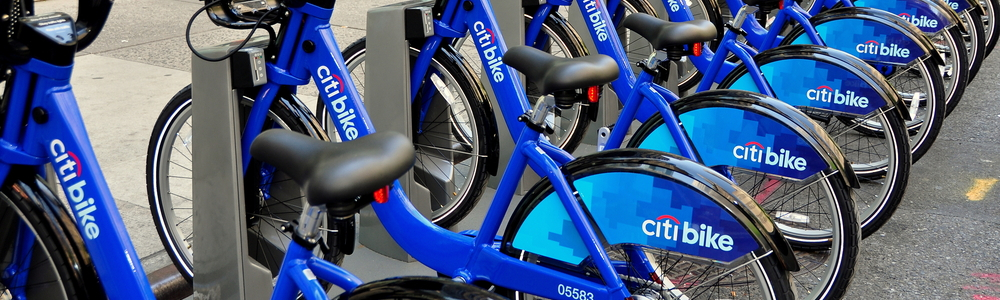

# Analysis insights

### **Frontpage**
- The frontpage contains a couple of calculations
- The total miles traveled, translated into laps around the globe has proven to be an excellent marketing pitch
- The average trip duration is lower than I would expect, but can be explained by the nature of the service, any citizen that needs to use a bike for larger distances will probably have its own
- The "fact" is basically a joke, which for presentations can help both the speaker and the audiency to relax

### **Time Analysis**
- The time span chosen for analysis was July 2020 to June 2021 (12 months)
- The bar chart (left) represents the percentage grow (red bar) from the previous month, the blue bar represents the total accumulated number of trips
    - From this chart it is interesting to notice how during the winter months the percentage increase in number of rides is reduced, but it is never negative, which is a strong indicator of the success of the program
- The area chart (right) represents the distribution of costumer/subscriber across the different months
    - It is very interesting to notice that the number of clients drops significantly during the winter season, reaching its lowest point by January
    - This phenomena should be investigated further, in order to determine the unerdlying causes that triggers this effect
- The bottom graph plots the usage by hour across the day
    - Not a lot of surprises from this visualization, the peak hour of service is at 17:00, the exact time where the workday is over

### **Geographical Analysis** 
- It is important to notice that to calculate station usage I considered event as either bike in or bike out
- One of the biggest advantages of statistical maps is that they are self-explanatory
- However it is important to notice ZIP code 07302
    - It is the busiest area
    - It contains 6 out of 10 of the top stations (both for starting or ending a trip)

### **Gender breakdown**
- This analysis only goes as far as January 2021, after that the program stops tracking gender
- The graphic clearly shows a male-female ratio of 2:1, but not a lot of further insight can be extracted. Probably the reason why gender is no longer tracked

### **Average trip duration by age**
- This is an interesting graphic
- People of 50-54 years old are taking longer rides, probably using the program for leisure reasons
- People between 25-49 take shorter rides, probably using the program for transportation purposes
- Marketing campaigns could be targeted using both of this insight in consideration

### **Miles by bike ID**
- This graphic was plotted with the intention to predict when a bike needs servicing
- However, since there is no way to tell the date in which a particular bike entered the program the this insight is unobtainable
- What I can extract though is that bike usage is consistend around batches, which probably means that once a batch of bikes enters the program, their usage is evenly distributed
- With this information should be possible to predict servicing (I am thinking tire changes) in bulk, which could save money in purchases

### **Times used by bike ID**
- This graphic helps me strengthen the previous analysis, bike usage is evenly distributed

